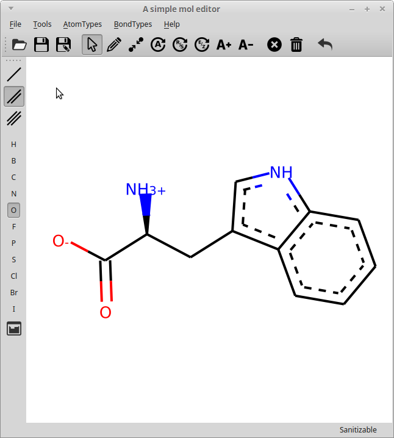

# GUIMolEditor
Molecule Editor GUI using RDKit


## Installation
* requirements

RDKIT and PySide2

* installation
```bash
python setup.py install

```
## Install
The install script Will also install PySide2, but not RDkit, so that should be installed manually or via your operating systems package manager.\

Install PySide and RDKit yourself, save the content of guimoleditor folder to somewhere you like and start it with 
`python guiMolEditor.py`

## Usage

Can be started with `python guiMolEditor.py` to start edit an existing molecule.
Interactions with the molecule are done via clicking on the canvas, atoms or bonds. A choice of tools is available.

From left to right
* Open: Open a molfile
* Save: Save current molecule
* Save As: Save current molecule with a new name
* Arrow: Select tool. Click on an atom to select it, click on the canvas to deselect. Clicking on multiple atoms one after another will select them, but only the lastly clicked one will be highlighted in red and used for operations, such as bond creation to another existing atom.
* Add bond / Join atoms: Will add a single bond between a clicked atom (or a previously selected atom) and the next atom clicked.
* Increase/Decrease charge: Will increase or decrease the charge of the atom clicked
* Delete atom/bond: 
* Clear Canvas
* Undo.

